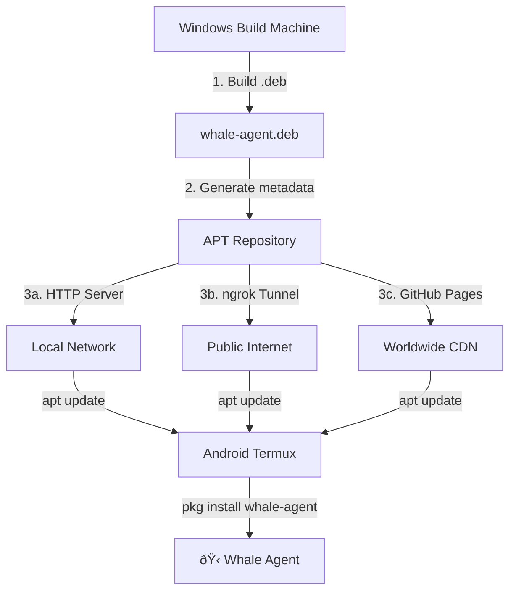

# 📇 WhaleTermux — Index & File Map

> A complete navigation map for the WhaleTermux custom Termux repository project.

---

## 📂 File Structure Overview

```
whaletermux/
│
├── 📄 README.md                 ← Project overview, badges, quick start
├── 📄 INDEX.md                  ← This file — structure map & navigation
├── 📄 INSTRUCTIONS.md           ← Complete step-by-step setup guide
├── 📄 termux-repo-guide.md      ← Raw chat export reference (original source)
│
├── 📁 whale-agent/              ← .deb package build workspace
│   ├── 📁 DEBIAN/
│   │   └── 📄 control           ← Package metadata (name, version, deps)
│   └── 📁 data/
│       └── 📁 data/com/termux/files/usr/bin/
│           └── 📄 whale          ← The whale agent executable script
│
└── 📁 termux-repo/              ← Generated APT repository (output)
    └── 📁 repo/
        └── 📁 dists/
            └── 📁 stable/
                └── 📁 main/
                    ├── 📁 binary-aarch64/     ← ARM 64-bit packages
                    │   ├── 📄 Packages
                    │   ├── 📄 Packages.gz
                    │   └── 📄 whale-agent.deb
                    ├── 📁 binary-arm/         ← ARM 32-bit packages
                    ├── 📁 binary-x86_64/      ← x86_64 packages (emulated)
                    └── 📁 binary-all/         ← Arch-independent packages
```

---

## 📑 File-by-File Reference

### Documentation Files

| File | Purpose | Who Should Read |
|------|---------|----------------|
| **[README.md](README.md)** | Project overview, badges, 30-second quick start | Everyone — start here |
| **[INDEX.md](INDEX.md)** | File structure map, navigation, this page | Developers & contributors |
| **[INSTRUCTIONS.md](INSTRUCTIONS.md)** | Full step-by-step setup from scratch | Users setting up the repo |
| **[termux-repo-guide.md](termux-repo-guide.md)** | Raw chat export with multi-agent discussion | Reference / history |

### Build Artifacts

| Path | Purpose |
|------|---------|
| `whale-agent/DEBIAN/control` | Package control file — name, version, architecture, description |
| `whale-agent/data/.../whale` | The actual whale agent shell script installed to `/usr/bin/whale` |
| `termux-repo/repo/dists/` | Generated APT repository structure with Packages index |
| `*.deb` | Built Debian package ready for distribution |

---

## 🧭 Quick Navigation

| I Want To... | Go To |
|--------------|-------|
| See what this project is about | [README.md](README.md) |
| Set up the repo step by step | [INSTRUCTIONS.md](INSTRUCTIONS.md) |
| Build a .deb package | `Step 2` in [INSTRUCTIONS.md](INSTRUCTIONS.md) |
| Host via GitHub Pages | `Step 4 (Option C)` in [INSTRUCTIONS.md](INSTRUCTIONS.md) |
| Install on my Android phone | `Step 5` in [INSTRUCTIONS.md](INSTRUCTIONS.md) |
| Skip APT and just download a script | `Quick Alternative` in [INSTRUCTIONS.md](INSTRUCTIONS.md) |
| Understand the repo layout | You're here! |

---

## 🏗️ Architecture Diagram



---

## 🔗 Quick Links

- [Termux Official Site](https://termux.com)
- [termux-apt-repo on GitHub](https://github.com/termux/termux-apt-repo)
- [Termux Package Management Docs](https://wiki.termux.com/wiki/Package_Management)
- [ngrok Download](https://ngrok.com/download)

---

## 📋 Checklist Status

- [x] 📄 **README.md** — Project overview & quick start
- [x] 📄 **INDEX.md** — File map & navigation
- [x] 📄 **INSTRUCTIONS.md** — Complete setup guide
- [x] 📄 **termux-repo-guide.md** — Raw reference export
- [x] 📦 **whale-agent.deb** — Build the actual package
- [x] 🌐 **termux-repo/** — Generate APT repo metadata
- [x] 🚀 **Deploy** — Push to GitHub Pages or serve locally

---

<p align="center">🐋 Keep swimming!</p>